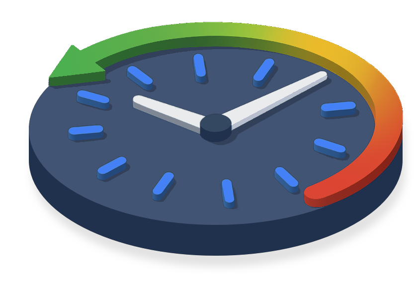
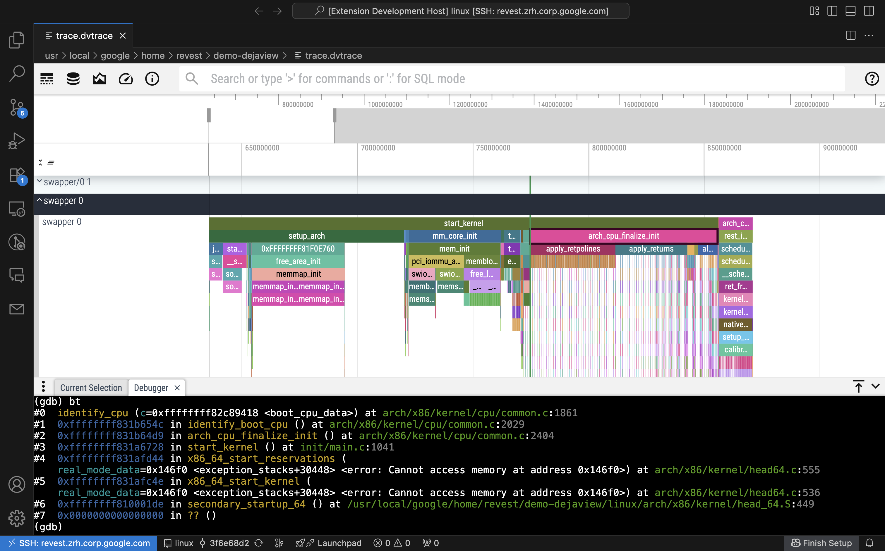

# DejaView - Full system deterministic record, replay and tracing



DejaView gives you the abilitiy to control and debug a QEMU full-system
deterministic record out of a function call graph visualization. This is highly
useful to debug Linux kernel crashes that involve complex interactions between
threads or across userspace and kernelspace for example.

DejaView is made out of:

- A QEMU TCG plugin that can generate function call graphs of the emulated OS
- A convenient trace format and visualization forked out of Perfetto v48.1
- The ability to control QEMU deterministic replay from the trace visualization
- The ability to control GDB attached to a QEMU replay from the visualization
- A VSCode plugin to tie everything together into a nice experience
- Helper scripts for kernel developers (to reproduce syzbot bugs for example)

You need at least QEMU v9.2.0 installed on your system for the plugin to work.



Build
=====

To build the native components (the QEMU TCG plugin and the `trace_processor`):

```
tools/install-build-deps
tools/gn args out/linux
```

Enter:

```
is_debug = true / false
cc_wrapper = "ccache"
```

Then:

```
tools/ninja -C out/linux
```

To build the trace visualization web UI:

```
tools/install-build-deps --ui
ui/build
```

Usage
=====

To record a trace, make sure to have a guest kernel built with DWARF info, eg:

```
git clone git://git.kernel.org/pub/scm/linux/kernel/git/torvalds/linux.git
cd linux/
git checkout a1e4cc0155ad577adc3a2c563fc5eec625945ce7~
make defconfig kvm_guest.config
scripts/config -e DEBUG_INFO_DWARF5
make -j`nproc`
```

Note: other kernel versions may store pointers to the current task in other
locations and therefore the QEMU TCG tracer plugin may fail to isolate
functions in nicely isolated threads. If you encounter this issue on your
kernel version, make sure to contribute improvements to the logic in
`src/qemu_plugin/vmi.cc`.

You can generate a rootfs with tools like `mkosi`, make sure they are in the
`qcow2` format since that's required for deterministic record snapshots. For
example:

```
sudo mkosi --distribution=debian --release=bookworm --format=disk -o image.raw --package systemd
qemu-img convert -f raw -O qcow2 image.raw image.qcow2
rm image image.raw
```

If you were to typically run your QEMU guest with a command like this:

```
qemu-system-x86_64 -nographic -s -bios qboot.rom -machine q35 -cpu max \
    -net nic,model=virtio-net-pci -net user,hostfwd=tcp::5555-:22 \
    -append "console=ttyS0,115200 root=/dev/sda1 rw nokaslr init=/lib/systemd/systemd debug systemd.log_level=info mitigations=off" \
    -smp 1 -m 4G -qmp tcp:localhost:4444,server,nowait -serial mon:stdio \
    -drive file=image.qcow2,id=rr -kernel $PWD/linux/arch/x86/boot/bzImage
```

You can add deterministic record with an extra `icount` flag at the end and
the function graph tracer with an extra `-plugin` flag at the end:

```
qemu-system-x86_64 -nographic -s -bios qboot.rom -machine q35 -cpu max \
    -net nic,model=virtio-net-pci -net user,hostfwd=tcp::5555-:22 \
    -append "console=ttyS0,115200 root=/dev/sda1 rw nokaslr init=/lib/systemd/systemd debug systemd.log_level=info mitigations=off" \
    -smp 1 -m 4G -qmp tcp:localhost:4444,server,nowait -serial mon:stdio \
    -drive file=image.qcow2,id=rr -kernel $PWD/linux/arch/x86/boot/bzImage \
    -icount shift=auto,rr=record,rrfile=replay.bin,rrsnapshot=init \
    -plugin out/linux/libqemu_plugin.so,symbols_from=$PWD/linux/vmlinux,starting_from=start_kernel,min_insns=1000 -d plugin
```

For the plugin to save the trace, you need to cleanly exit QEMU with `Ctrl-A-X`.

Once your trace and deterministic record are saved on disk, you need to run a
process called `trace processor` with:

```
out/linux/trace_processor_shell -D trace.dvtrace
```

This agent is able to read the local trace file and expose SQL tables to the
web UI so that trace visualization is fast. Additionally, it is also able to
spawn QEMU replays and GDB sessions to debug QEMU replays from the UI.

You can then run the web UI with:

```
ui/run-dev-server
```

It should notice that your `trace_processor` is running and offer to connect to
it. If you let it connect, you'll get an overview of the trace and if you click
on a function "slice" it should open a details pane at the bottom of your
screen. From that pane, you can click on "Debug" which will trigger a
deterministic replay up that slice and drop you into a debugger.

A VSCode extension is also provided to integrate the trace visualization and
control one step further in your kernel development experience, you can build
it with:

```
cd vscode-dejaview/
npm install
npm watch
```
